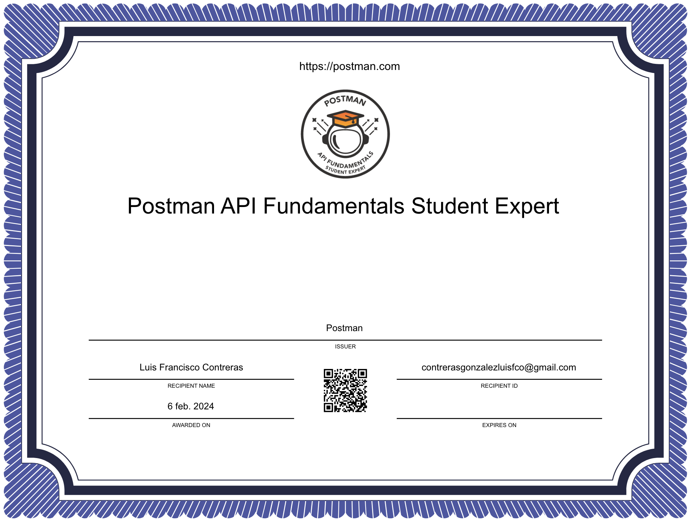

# POSTMAN API Testing project

## Postman API Fundamentals Student Expert certification

This REST API allows you to CRUD (Create, Read, Update, Delete) books in a public library database. 

Using Postman to interact with this API and manage books. 

According to the API documentation, you can get all the books in the library by making a request to GET https://library-api.postmanlabs.com/books

### This Project includes the following:

- GET requests
- Variables 
- POST requests
- Scripting
- PATCH and DELETE requests
- API Key Authorization
- Generating code

#### Usage 

1. Clone the Repository
2. Open Postman:
3. Import the Collection: 
- Open Postman.
- Click on "Import" in the top left corner.
- Choose the exported JSON file in the postman_collection directory.
4. Run Requests in Postman and observe the responses.